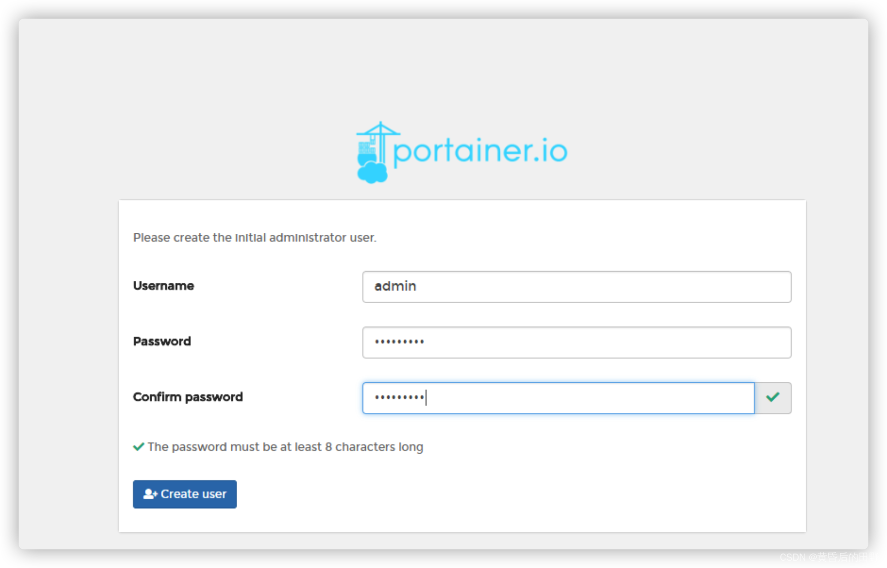

### 安装docker
用yum源安装
```bash
#-y表示不询问安装，直到安装成功，安装完后再次查看安装列表
yum -y install docker

```
###　查看是否已安装docker列表

```bash
yum list installed | grep docker
```

### 启动docker

```bash
systemctl start docker

```

### 查看docker服务状态

```bash
systemctl status docker

```

恭喜你安装成功😍😍😍😍

### 第二步安装docker可视化工具

```bash
# 查询当前有哪些Portainer镜像
docker search portainer

# 下载镜像
docker pull portainer/portainer

```

### 3.1、单机版运行
如果仅有一个docker宿主机，则可使用单机版运行，运行以下命令就可以启动了:

```bash
//英文版
docker run -d -p 9000:9000 
    --restart=always 
    -v /var/run/docker.sock:/var/run/docker.sock 
    --name prtainer-test 
    portainer/portainer
//汉化版
docker pull hub-mirror.c.163.com/6053537/portainer-ce
docker run -d --restart=always --name="portainer" -p 9000:9000 -v /var/run/docker.sock:/var/run/docker.sock -v portainer_data:/data 6053537/portainer-ce

```

成功

接下来是 IP + 端口号 9000 (可以改的哦) ,再腾讯云 =》 防护墙 =》 添加9000端口就可以访问了

