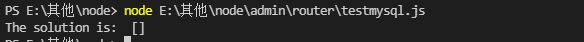

## 数据库 增删改查
使用node 链接mysql实现 增删改查
## 安装node版Mysql数据库的驱动模块

```
 npm install mysql
```

//引入msyql
单个连接池
```JS
var mysql      = require('mysql');
var connection = mysql.createConnection({
  host     : 'localhost',
  user     : '用户名',
  password : '密码',
  database : '数据库'
});

connection.connect();

connection.query('sql语句',function(error, results, fields){
    if (error) throw error;
  console.log('The solution is: ', results[0].solution);
})

connection.end();//断开连接
```

多个连接池

```JS
var mysql = require('mysql');
var pool  = mysql.createPool({
  connectionLimit : 10,//最多连接数
  host            : 'localhost',
  user            : '用户名',
  password        : '密码',
  database        : '数据库名'
});
 
pool.query('sql 语句', function (error, results, fields) {
  if (error) throw error;
  console.log('The solution is: ', results);
});

```

### 案例：
创建数据库db_test;
> create database db_test;

查看是数据库

>show databases;

使用 db_test;
> use db_test;

创建一个数据表 tb_test,字段列（id 自增，name 20字，age ）都不为空;
```js
create table tb_test(id int primary key auto_increment, name varchar(20) not null,age smallint not null);

```
查看是否有tb_test表；

>show tables;

创建test-mysql.js，测试是连接数据库

```js
var mysql = require('mysql');
var connection = mysql.createConnection({
    host: 'localhost',
    user: 'root',
    password: 'a12345',
    database: 'db_test'
});

connection.connect();

connection.query('select * from tb_test', function (error, results, fields) {
    if (error) throw error;
    console.log('The solution is: ', results);
})

connection.end();

```

在终端进入

输入
```
node E:\其他\node\admin\router\testmysql.js
```


可以到连接成功了

## 使用Sequelize建立model

- 安装
    ```js
    npm install --save sequelize
    npm install --save mysql2
    ```

- 连接数据
```js
const { Sequelize } = require('sequelize');
// 方法 3: 分别传递参数 (其它数据库)
const sequelize = new Sequelize('database', 'username', 'password', {
  host: 'localhost',
  dialect: 'mysql'/* 选择 'mysql' | 'mariadb' | 'postgres' | 'mssql' 其一 */
});
```
- 建立模型
```js
//没有指定库（tableName）,模型名称(User)映射到users表
const User = sequelize.define('User', {
    // 在这里定义模型属性
    name: {
        type: DataTypes.STRING,
        allowNull: false
    }
}, {
    // 这是其他模型参数
    sequelize,
    timestamps: false,//去掉时间戳
    // tableName: 'company_table'//指定库
});
//模型建立后，查询数据
const data = await Company.findAll()
```
