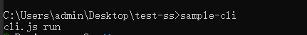

### 简介
这篇介绍脚手架工具，使用yeoman,plop 创建，还有自定义创建cli
## 使用第三方yeoman
```js
npm install -g yo 
yarn global add yo
```
## 安装对应 generater
```js
npm i generater-node -g 
yarn global add generater-node
```
## yo 运行generator
```js
yo node
```
### Yeoman Sub Generator
Generator不一定都会有子集
[支持子集Generator](https://github.com/yeoman/generator-node)

- 作用：在某些某些项目配置通用的的一些文件
```js
yo node:cli
yarn
yarn link
chen-module  --help
```
## Yeoman 基本使用步骤
1. 明确你的需求
2. 找到合适的Generator
3. 全局安装找到的Generator
4. 通过yo运行对应的Generator
5. 通过命令行交互填写选项
6. 生成项目结构

## 创建 自定义generator
- 步骤
[源码](https://github.com/mzmuping/mzmuing-vue-cli)
```js
//文件名 规范 generator-<name>
mkdir generator-sample //创建项目文件
yarn init  // 初始化package.json文件
yarn add yeoman-generator // 添加yeomona 引入模块,自定义要继承者模块
code . //vscode 打开
generators/app/index.js  // 作为入口文件
yarn link //创建全局映射
yo sample //使用
npm publish // 推送到npm
```
- 目录结构
```
|---generator
    |--- app
        |--- index.js
```
### 写法
index.js 文件是继承入口，返回一个继承yeoman-generator类

基本使用
```js
const Generator = require('yeoman-generator')

module.exports = class extends Generator{
    initianlizing(){
        //获取当前项目状态，获取基本配置参数等
    }
    prompting(){
        //向用户展示交互式问题收集关键参数
        return this.prompt([
        {
            type: 'input',
            name: 'name',
            message: 'Your project name',
            default: this.appname//appname 目录名
        }
        ]).then(answers => {
            this.answers = answers;
        })
    }
    configuring(){
        //保存配置相关信息且生成配置文件（名称多为'.'开头的配置文件,例如.editorconfig）
    }
    default(){
        //未匹配任何生命周期方法的非私有方法均在此环节*自动*执行
    }
    writing(){
        //依据模板进行新项目结构的写操作

        //生成目录的时候会自动调用该方法
        this.fs.write(this.destinationPath('temp.text'), Math.random().toString())

    }
    conflicts(){
        //处理冲突(内部调用，一般不用处理）
    }
    install(){
        //使用指定的包管理工具进行依赖安装(支持npm,bower,yarn)
    }
    end(){
        //结束动作，例如清屏，输出结束信息，say GoodBye等等
    }

}
```

### plop 
一个小而美的脚手架工具

### 手写cli

步骤：
1. 创建项目 sample-cli
2. yarn init // 创建package.json
3. 创建cli.js // 填写下面文件
```js
#!/usr/bin/env node
// Node CLI 应用入口文件必须要有这样文件头
// 如果是linux 或者 macOS 系统下还需要修改此文件的读写权限为755
// 具体就是通过 chmod 755 cli.js 实现修改
console.log('cli is run ')
```
4. 在package.json 添加
```
{
"bin": "cli.js",
}
```
5. yarn link // 挂载全局
6. 测试=》 在新文件夹 cmd 中入sample-cli

结果：


上图node cli就跑起来了

下面我们添加一个创建基本模板文件

先按照依赖：
```js
yarn add inquirer -D
yanr add ejs -D
```
代码实现
```js
#!/usr/bin/env node

// Node CLI 应用入口文件必须要有这样文件头
// 如果是linux 或者 macOS 系统下还需要修改此文件的读写权限为755
// 具体就是通过 chmod 755 cli.js 实现修改

// 脚手架的工作过程：
// 1. 通过命令行交互询问用户问题
// 2. 根据用户回答的结果生成文件
const inquirer = require('inquirer')
const fs = require('fs');
const path = require('path');
const ejs = require('ejs');
inquirer.prompt([
    {
        type: 'input',
        name: 'name',
        message: 'Project name?'
    }
])
    .then(answers => {
        //根据用户回答的结果生成文件

        //模板目录
        const temlDir = path.join(__dirname, 'templates');

        //目标目录
        const destDir = process.cwd();
        //读取文件
        fs.readdir(temlDir, (err, files) => {
            if (err) throw err
            files.forEach(file => {
                //ejs 替换用户交互内容
                ejs.renderFile(path.join(temlDir, file), answers, (err, result) => {
                    if (err) throw err;
                    //输出模板到目标目录
                    fs.writeFileSync(path.join(destDir, file), result);
                });
            })
        })

    })
```