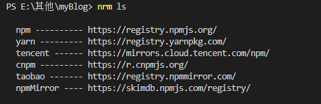

## 注册npm账号

[官网](https: //www.npmjs.com/)

##　发布包
```js
npm login
npm publish
```

## 镜像源管理

### npm查看、设置镜像源
查看当前镜像源
```js
npm get registry
```

### 全局设置taobao镜像源

```js
npm config set registry https://registry.npmmirror.com/
```

### nrm镜像源管理工具
全局安装 nrm
```js
npm install nrm -g
```
###　查看当前可使用的镜像源
```js
nrm ls
```
以下图片


### 切换镜像源

```js
nrm use yarn
```

## node 版本工具
解决node各种版本存在不兼容现象,nvm是让你在同一台机器上安装和切换不同版本的node的工具，通过它可以安装和切换不同版本的nodejs

### 安装
可在点此在[github](https://github.com/coreybutler/nvm-windows/releases)上下载最新版本,本次下载安装的是windows版本。

选择下载

　　nvm-setup.zip：安装版，推荐使用，下一步式傻瓜安装

　　nvm-noinstall.zip：绿色免安装版，但使用时需进行配置环境变量。

双击nvm-setup.exe文件安装

注意：
1. 安装路径最好不要出现中文和空格
2. 如果安装成功，cmd nvm version 报错，需要配置`环境变量`

###　安装完确认,查看版
```js
nvm version
```

### 查看已安装node
```js
nvm ls
```

### 安装最新版本
```js
nvm install node 
```

### 安装指定版本
```js
nvm install 18.7.0
```

### 使用版本
```js
nvm use 18.7.0
```

### 卸载版本号的Node

```js
nvm uninstall 18.7.0
```
### 命令行
```js
nvm arch ：显示node是运行在32位还是64位。
nvm install <version> [arch] ：安装node， version是特定版本也可以是最新稳定版本latest。可选参数arch指定安装32位还是64位版本，默认是系统位数。可以添加--insecure绕过远程服务器的SSL。
nvm list [available] ：显示已安装的列表。可选参数available，显示可安装的所有版本。list可简化为ls。
nvm on ：开启node.js版本管理。
nvm off ：关闭node.js版本管理。
nvm proxy [url] ：设置下载代理。不加可选参数url，显示当前代理。将url设置为none则移除代理。
nvm node_mirror [url] ：设置node镜像。默认是https://nodejs.org/dist/。如果不写url，则使用默认url。设置后可至安装目录settings.txt文件查看，也可直接在该文件操作。
nvm npm_mirror [url] ：设置npm镜像。https://github.com/npm/cli/archive/。如果不写url，则使用默认url。设置后可至安装目录settings.txt文件查看，也可直接在该文件操作。
nvm uninstall <version> ：卸载指定版本node。
nvm use [version] [arch] ：使用制定版本node。可指定32/64位。
nvm root [path] ：设置存储不同版本node的目录。如果未设置，默认使用当前目录。
nvm version ：显示nvm版本。version可简化为v。
```