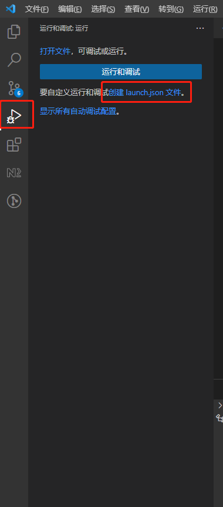
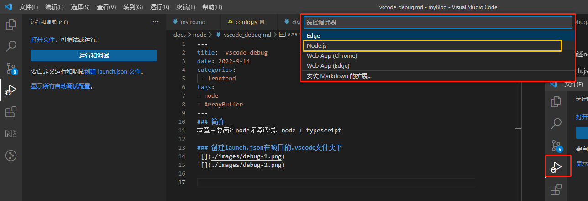
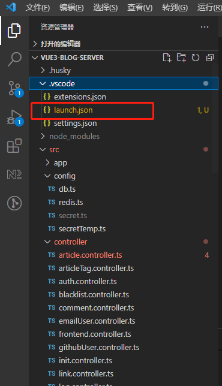

### 简介
本章主要简述node环境调试。node + typescript

### 创建launch.json在项目的.vscode文件夹下




### 默认生成基本配置
```js
{
    // 使用 IntelliSense 了解相关属性。 
    // 悬停以查看现有属性的描述。
    // 欲了解更多信息，请访问: https://go.microsoft.com/fwlink/?linkid=830387
    "version": "0.2.0",
    "configurations": [
        {
            "type": "node",
            "request": "launch",
            "name": "Launch Program",
            "skipFiles": [
                "<node_internals>/**"
            ],
            "program": "${file}"
        }
    ]
}
```
做了一下就下

```js
{
  // 使用 IntelliSense 了解相关属性。
  // 悬停以查看现有属性的描述。
  // 欲了解更多信息，请访问: https://go.microsoft.com/fwlink/?linkid=830387
  "version": "0.2.0",
  "configurations": [
    {
      "type": "node",
      "request": "launch",
      "name": "启动程序",//名称
      "runtimeArgs": ["-r", "ts-node/register", "--inspect"],//用ts-node 启动
      "skipFiles": ["<node_internals>/**"],
      "program": "${workspaceFolder}\\src\\index.ts",//程序入口
       // 在调试之前，需要将 TypeScript 编译成 JS.
       // 对于 TS 调试有两个注意点:launch.json 中的 outFile 路径，需要与 tsconfig.json 中的 outDir 保持统一; tsconfig.json 中将 sourceMap 指定为 true。
       // "preLaunchTask": "tsc: build - tsconfig.json",
       // 这里是在告诉 VS Code，编译后的代码文件输出到了哪个位置。
       // 需要在 tsconfig.json 中，将 outDir 指定为 dist。
      "outFiles": ["${workspaceFolder}/**/*.ts"],
      "env": {//环境变量
        "NODE_APP_RELEASE_PROJECT_NAME": "vue3-blog-server",
        "NODE_APP_RELEASE_PROJECT_ENV": "development",
        "NODE_APP_RELEASE_PROJECT_PORT": 3300
      }
    }
  ]
}
```
[参考](https://blog.csdn.net/Ed7zgeE9X/article/details/126187699)