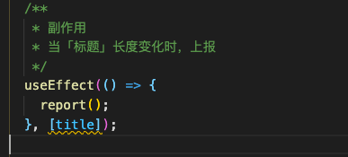

### useCallback问题和隐患并给出解决方案
返回一个 memoized 回调函数。
把内联回调函数及依赖项数组作为参数传入 `useCallback`，它将返回该回调函数的 memoized 版本，
该回调函数仅在某个依赖项改变时才会更新。当你把回调函数传递给经过优化的并使用引用相等性去避免非必要渲染（例如 shouldComponentUpdate）的子组件时，它将非常有用,


###  使用 useCallback 的场景
- 函数被 useEffect 内部所使用，但为了避免频繁 useEffect 的频繁调用，所以我包一下
- 当这个函数会被传递给子组件，为了避免子组件频繁渲染，使用 useCallback 包裹，保持引用不变（使用的最多的场景）
- 因为有一个使用了 useCallback 的函数引用了我这个函数，所以我不得不包一下
- 我只是为了解决 hooks lint 的提示报警，所以我包一下
- 需要保存一个函数闭包结果，如配合 debounce、throttle 使用；
- 我希望这个useCallback包裹的函数，但某个依赖项变化时，引用了我这个函数的所有 useEffect 都得重新执行一下；


### 案例
假如这里有个文章组件，我想观察当「文章内容」明确后， 用户对「文章标题」的修改频率如何。这个
具体实现：当「文章内容」的长度大于 0 时编辑「文章标题」就上报埋点，同时带上「文章标题」和「文章内容」的 字符长度。

点击链接，打开 console 看[Demo](https://codepen.io/huyao/pen/LYbdomv?editors=0010)

写出了下面这一段代码，大家可以细看一下，有哪些地方需要优化？它有哪些地方不规范？

```js

// 新建文章组件
function EditArticle() {
  const [title, setTitle] = useState("");
  const [content, setContent] = useState("");
  const [other, setOther] = useState("");
 
 
  // 获取当前「标题」和「内容」的长度
  const getTextLen = () => {
    return [title.length, content.length];
  };
 
 
  // 上报当前「标题」和「内容」的长度
  const report = () => {
    const [titleLen, contentLen] = getTextLen();
    if (contentLen > 0) {
      console.log(`埋点 >>> O长度 ${titleLen}, kr长度${contentLen}`);
    }
  };
 
 
  /**
   * 副作用
   * 当「标题」长度变化时，上报
   */
  useEffect(() => {
    report();
  }, [title]);
 
 
  return (
    <div className="App">
       文章标题   <input value={title} onChange={(e) => setTitle(e.target.value)} />
 
 
       文章内容  <input value={content} onChange={(e) => setContent(e.target.value)} />
 
 
       其他不相关状态：<input value={other} onChange={(e) => setOther(e.target.value)} />
 
 
      <MemoArticleTypeSetting getTextLen={getTextLen} />
    </div>
  );
}
enum ArticleType {
  WEB = "前端",
  SERVER = "后端",
}
 
 
// 子组件，修改文章类型（无需关注，它只是接受了父组件的一个参数而已）
const ArticleTypeSetting: FC<{ getTextLen: () => number[] }> = ({  getTextLen }) => {
  console.log(" --- ArticleTypeSetting 组件重新渲染 --- ");
 
 
  const [articleType, setArticleType] = useState<ArticleType>(ArticleType.WEB);
 
 
  const handleChange = (e: React.ChangeEvent<HTMLInputElement>) => {
    setArticleType(e.target.value as ArticleType);
 
 
    console.log(  "埋点 >>> 切换类型，当前「标题」和「内容」长度：", getTextLen()  );
  };
 
 
  return (
    <div>
      <div>文章类型组件，当选择类型时上报「标题」和「内容」长度</div>
      <div>
        {[ArticleType.WEB, ArticleType.SERVER].map((type) => (
          <div>  
            <input  type="radio" value={type} checked={articleType === type} onChange={handleChange}  /> 
           {type} 
          </div>
        ))}
      </div>
    </div>
  );
};
 
 
const MemoArticleTypeSetting = memo(ArticleTypeSetting);
```
### CodeReview 与修改

### 哪些地方需要优化？
子组件 ArticleTypeSetting 是使用 memo 包裹的，这个组件是希望尽可能的减少渲染次数的（假装这个组件有性能问题，一般不用包）。但是，现在每当修改任意一个值（如 other），子组件都会重新渲染，这显然是没有达到优化的预期的

### 哪些地方不规范？

这里不规范， useEffect 中使用了 report 函数，但是没有将它放到依赖数组中。我认为这是一件比较危险的事情，在 Hooks 中经常有过期状态的问题。插件已经帮你提示了，虽然现在你自测感觉没问题，但你很难保证在经过几轮轮修改之后，虽然你的代码一堆 warning 或 error，但跑起
来没问题。

### 修改代码

对代码进行了一些修改：

- 将 getTextLen 和 report 使用 useCallback 包裹
    ```js
        // 获取当前「标题」和「内容」的长度
        const getTextLen = useCallback(() => {
            return [title.length, content.length];
        }, [title, content]);
        
        
        // 上报当前「标题」和「内容」的长度
        const report = useCallback(() => {
            const [titleLen, contentLen] = getTextLen();
            if (contentLen > 0) {
            console.log(`埋点 >>> O长度 ${titleLen}, kr长度${contentLen}`);
            }
        }, [getTextLen]);
        
        
        /**
        * 副作用
        * 当「标题」长度变化时，上报
        */
        useEffect(() => {
            report();
        }, [title, report]);
    ```
    - 还有问题吗？

        有，当 「文章内容」修改了之后，会触发 useEffect 继续上报，这个问题比较隐晦，不再回归测试的话难以发现；并且编辑文章内容时子组件也在重新渲染。

### 为什么出了问题

我的初衷只是使用 useCallback 避免频繁调用，但当一个 useCallback 的依赖项变化后，这个 useEffect 会被执行，就像上面修改过后的代码一样，「文章内容」修改了之后，也会触发 useEffect 的，这就是「useCallback 带来的隐式依赖问题」。

### 如何解决 
将 函数绑定到 useRef 上来解决

```js

 const getTextLenRef = useRef<() => [number, number]>(() => [0, 0]);
 
 
  // 获取当前「标题」和「内容」的长度
  getTextLenRef.current = () => {
    return [title.length, content.length];
  };
 
 
  // 上报当前「标题」和「内容」的长度
  const report = () => {
    const [titleLen, contentLen] = getTextLenRef.current();
    if (contentLen > 0) {
      console.log(`埋点 >>> O长度 ${titleLen}, kr长度${contentLen}`);
    }
  };
 
 
  /**
   * 副作用
   * 当「标题」长度变化时，上报
   */
  useEffect(() => {
    report();
  }, [title]);
```
将函数绑定到 Ref上，ref 引用不论怎样都保持不变，而且函数每次 render ref 上又会绑定最新的函数，不会有闭包问题。我在开发一个复杂项目中，大量的使用了这种方式，这让我的开发效率提升。它让我专注于写业务，而不是专注于解决闭包问题。

这种处理方式的灵感来源于 Dan 的博客：使用 React Hooks 声明 setInterval

### 优化使用 ref 的体验

虽然把函数挂到 ref 上可以很好到解决这个问题，但是我在开发的时候我并不知道一个函数之后会不会碰到这个闭包问题，但我又不想所以函数全部都这样干。

我对这种方式抽象封装了一下，得到这样一个工具函数，它通过将函数挂到 ref 上，保证永远都是拿到最新状态的函数，往外暴露时使用 useCallback 包裹，保证函数引用不更新。

```js

export function useRefCallback<T extends (...args: any[]) => any>(callback: T) {
  const callbackRef = useRef(callback);
  callbackRef.current = callback;
  return useCallback((...args: any[]) => callbackRef.current(...args), []) as T;
}
```

使用时，简单的把原来有闭包问题的函数包裹一下，不需要传递依赖性，方便简单又好用。

点击链接，打开 console 看[Demo](https://codepen.io/huyao/pen/XWNELYr?editors=0010)

```js

  // 获取当前「标题」和「内容」的长度
  const getTextLen = useRefCallback(() => {
    return [title.length, content.length];
  });
 
 
  // 上报当前「标题」和「内容」的长度
  const report = useRefCallback(() => {
    const [titleLen, contentLen] = getTextLen();
    if (contentLen > 0) {
      console.log(`埋点 >>> O长度 ${titleLen}, kr长度${contentLen}`);
    }
  });
 
 
  /**
   * 副作用
   * 当「标题」长度变化时，上报
   */
  useEffect(() => {
    report();
  }, [title, report]);
```

### 思考我们最开始使用 useCallback 的理由
我认为其实最开始使用 useCallback 的理由中，只有「需要保存一个函数闭包结果，如配合 debounce、throttle 使用」这个是真正需要使用 useCallback 的，其他的都可能带来风险，比如：

当 useCallback 和 useEffect 组合使用时，由于 useCallback 的依赖项变化也会导致 useEffect 执行，这种隐式依赖会带来BUG或隐患。

因为在编程中，函数只是一个工具，但现在一旦某个函数使用了 useCallback ，当这个函数的依赖项变化时所有直接或间接调用这个 useCallback 的都需要回归。所以我说这是成本高、有风险的事情。

而「希望这个useCallback函数的某个依赖项变化时，引用了我这个函数的所有 useEffect 都得重新执行一下」这个理由，我认为它是有风险的，虽有有时候你确实希望这么做，但我认为这样在设计上就不对，副作用怎么调用应该由副作用来决定，不应该由依赖的函数来影响，当你真正碰上这个场景，你应该将所有应该主动的把触发 useEffect 执行的状态都放入依赖数组中。

### 结论
在绝大多数情况下，开发者想要的仅仅只是避免函数的引用变化而已，而 useCallback 带来的隐式依赖问题会给你带来很大的麻烦，所以推荐使用 useRefCallback，把函数挂到 ref 上，这样代码更不容易留下隐患或带来问题，还可以省去维护 useCallback 依赖项的精力。

而 useRefCallback 本质上就是帮你把函数挂在 ref 上，并方便你使用 ref.current。

```js

export function useRefCallback<T extends (...args: any[]) => any>(callback: T) {
  const callbackRef = useRef(callback);
  callbackRef.current = callback;
 
 
  return useCallback((...args: any[]) => callbackRef.current(...args), []) as T;
}
```