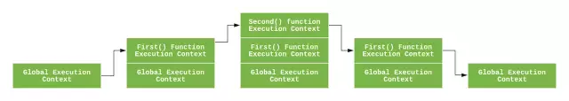

### 简述

JS是单线程的语言，执行顺序肯定是顺序执行，但是JS 引擎并不是一行一行地分析和执行程序，而是一段一段地分析执行，会先进行编译阶段然后才是执行阶段。

### 执行上下文栈（调用栈）
JavaScript 引擎创建了执行上下文栈（Execution context stack，ECS）来管理执行上下文
为了模拟执行上下文栈的行为，让我们定义执行上下文栈是一个数组：  
```js
ECStack = [//结构是后入先出
    globalContext//最底部永远有个 globalContext,全局变量
];
```
案例：
```js
function fun3() {
    console.log('fun3')
}

function fun2() {
    fun3();
}

function fun1() {
    fun2();
}

fun1();
```
执行上下文栈变化：
```js
// 伪代码

// fun1()
ECStack.push(<fun1> functionContext);

// fun1中竟然调用了fun2，还要创建fun2的执行上下文
ECStack.push(<fun2> functionContext);

// 擦，fun2还调用了fun3！
ECStack.push(<fun3> functionContext);

// fun3执行完毕
ECStack.pop();

// fun2执行完毕
ECStack.pop();

// fun1执行完毕
ECStack.pop();

// javascript接着执行下面的代码，但是ECStack底层永远有个globalContext

```


### 执行上下文

- 全局执行上下文：只有一个，浏览器中的全局对象就是 window 对象，this 指向这个全局对象。

- 函数执行上下文：存在无数个，只有在函数被调用的时候才会被创建，每次调用函数都会创建一个新的执行上下文。

- Eval 函数执行上下文： 指的是运行在 eval 函数中的代码，很少用而且不建议使用。

下面讲解 全局执行上下文，函数执行上下文 

### 对于每个执行上下文，都有三个重要属性：

- 变量对象(Variable object，VO)
- 作用域链(Scope chain)
- this

### 全局上下文
我们先了解一个概念，叫全局对象。在 W3School 中也有介绍

> 全局对象是预定义的对象，作为 JavaScript 的全局函数和全局属性的占位符。通过使用全局对象，可以访问所有其他所有预定义的对象、函数和属性。

> 在顶层 JavaScript 代码中，可以用关键字 this 引用全局对象。因为全局对象是作用域链的头，这意味着所有非限定性的变量和函数名都会作为该对象的属性来查询。

> 例如，当JavaScript 代码引用 parseInt() 函数时，它引用的是全局对象的 parseInt 属性。全局对象是作用域链的头，还意味着在顶层 JavaScript 代码中声明的所有变量都将成为全局对象的属性。

总结： 全局上下文中的变量对象就是全局对象呐！

案例：
1、在客户端 JavaScript 中，this 指向全局对象就是window对象
```js
console.log(this)

```

### 函数上下文

在函数上下文中，我们用活动对象(activation object, AO)来表示变量对象

活动对象是在进入函数上下文时刻被创建的，它通过函数的 arguments 属性初始化。 arguments 属性值是 Arguments 对象。

#### 执行过程
执行上下文的代码会分成两个阶段进行处理：分析和执行，我们也可以叫做：

进入执行上下文(预编译)
代码执行

---------

进入执行上下文时，初始化的规则如下，从上到下就是一种顺序：

进入执行上下文：

1. 函数的所有形参（如果是函数上下文）
    + 由名称与对应值组成的一个变量对象的属性被创建
    + 没有实参，属性值设为undefined
2.  函数声明
    + 由名称与对应值 (函数对象function-object) 组成的一个变量对象的属性被创建
    + 如果变量对象已存在同名的属性，则完全替换这个属性值
3. 变量声明
    + 由名称与对应值（undefined）组成一个变量的属性被创建
    + 如果变量名称跟已经声明的形式参数或函数相同，则变量声明不会干扰已经存在的这类属性

举个例子:

```js
function foo(a) {
  var b = 2;
  function c() {}
  var d = function() {};

  b = 3;

}

foo(1);
```
在进入执行上下文后，这时候的 AO 是：

```js
//编译前函数被提升放到顶部了，如：
function foo(a) {
  function c() {}
  var b = 2;
  var d = function() {};
  b = 3;
}

AO = {
    arguments:{
        0:1,
        length:1
    },
    a:1,
    b:undefined,
    c:reference to function c(){},
    d:undefined,
}
```
#### 代码执行
在代码执行阶段，会顺序执行代码，根据代码，修改变量对象的属性值

分析上面代码，变量对象属性值数据变化：
```js
AO={
    arguments:{
        0:1,
        length:1
    },
    a:1,
    b:3 
    c:reference to function c(){}
    d:reference to FunctionExpression "d",
}
执行循序变化：

进入函数
    ==》
    执行 var b = 2;// AO.b:2, b值变为2
    ==》
    执行 var d = function() {}; // AO.d= function() {}, d值指向一个匿名函数
    ==》 b = 3; // AO.b = 3; // b值被赋值为3
```

到这里变量对象的创建过程就介绍完了，让我们简洁的总结我们上述所说：
1. 全局上下文的变量对象（VO）初始化是全局对象
2. 函数上下文的变量对象 (AO) 初始化只包括 Arguments 对象
3. 在进入执行上下文时会给变量对象添加形参、函数声明、变量声明等初始的属性值
4. 在代码执行阶段，会再次修改变量对象的属性值


### 思考题
1.第一题
```js
function foo() {
    console.log(a);
    a = 1;
}

foo(); // ???

function bar() {
    a = 1;
    console.log(a);
}
bar(); // ???
```

第一段会报错：Uncaught ReferenceError: a is not defined。

第二段会打印：1。

这是因为函数中的 "a" 并没有通过 var 关键字声明，所有不会被存放在 AO 中。

第一段执行 console 的时候， AO 的值是：
```js
AO = {
    arguments: {
        length: 0
    }
}
```
没有 a 的值，然后就会到全局去找，全局也没有，所以会报错。

当第二段执行 console 的时候，全局对象已经被赋予了 a 属性，这时候就可以从全局找到 a 的值，所以会打印 1。

第二题
```js
console.log(foo);

function foo(){
    console.log("foo");
}

var foo = 1;

//VO
VO = {
    foo: reference to function foo(){console.log("foo");},
    foo:undefined
}
```

会打印函数，而不是 undefined 。

这是因为在进入执行上下文时，首先会处理函数声明，其次会处理变量声明，如果变量名称跟已经声明的形式参数或函数相同，则变量声明不会干扰已经存在的这类属性。

### 作用域 
作用域是指程序源代码中定义变量的区域。

作用域规定了如何查找变量，也就是确定当前执行代码对变量的访问权限。

JavaScript 采用词法作用域(lexical scoping)，也就是静态作用域。

因为JavaScript采用的是词法作用域，函数的作用域基于函数创建的位置。

例子：
```js
var value = 1;

function foo() {
    console.log(value);
}

function bar() {
    var value = 2;
    foo();
}

bar();

// 结果是 ???
```

JavaScript采用静态作用域，让我们分析下执行过程：

执行 foo 函数，先从 foo 函数内部查找是否有局部变量 value，如果没有，就根据书写的位置，查找上面一层的代码，也就是 value 等于 1，所以结果会打印 1。


### 作用域链

在《思考题》中讲到，当查找变量的时候，会先从当前上下文的变量对象中查找，如果没有找到，就会从父级(词法层面上的父级)执行上下文的变量对象中查找，一直找到全局上下文的变量对象，也就是全局对象。这样由多个执行上下文的变量对象构成的链表就叫做作用域链。

下面，让我们以一个函数的创建和激活两个时期来讲解作用域链是如何创建和变化的。

###　函数创建

在《JavaScript深入之词法作用域和动态作用域》中讲到，函数的作用域在函数定义的时候就决定了。

这是因为函数有一个内部属性 [[scope]]，当函数创建的时候，就会保存所有父变量对象到其中，你可以理解 [[scope]] 就是所有父变量对象的层级链，但是注意：[[scope]] 并不代表完整的作用域链！

举个例子：
```js
function foo() {
    function bar() {
        ...
    }
}
```

函数创建时，各自的[[scope]]为：
```js
foo.[[scope]] = [
  globalContext.VO
];

bar.[[scope]] = [
    fooContext.AO,
    globalContext.VO
];
```

