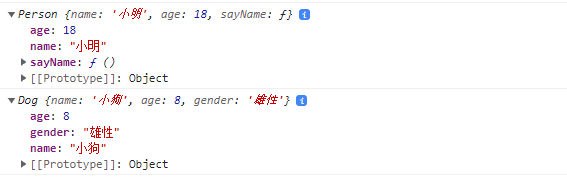
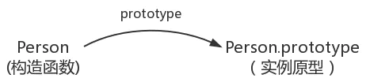
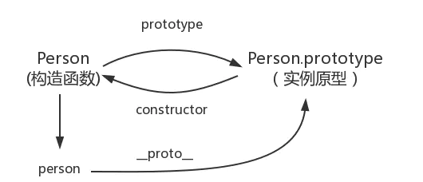
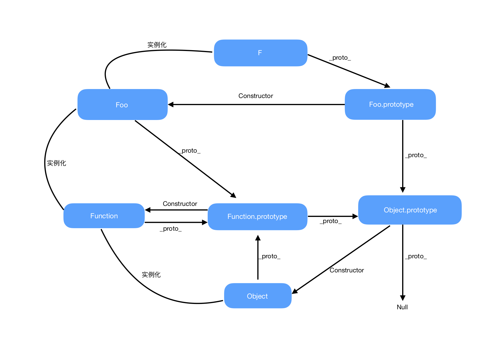
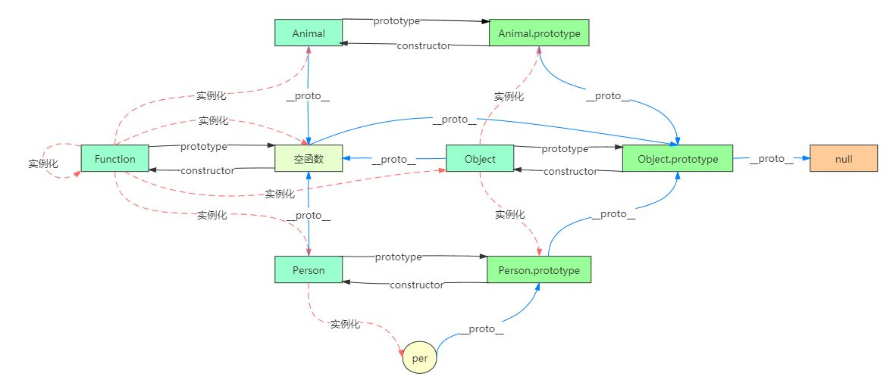

### JS中的原型和原型链
- 原型： 在JavaScript中，每当定义一个函数数据类型(普通函数、类)时候，都会天生自带一个prototype属性，这个属性指向函数的原型对象，并且这个属性是一个对象数据类型的值
- 原型链： JavaScript 只有一种结构：对象。每个实例对象（object）都有一个私有属性（称之为 __proto__ ）指向它的构造函数的原型对象（prototype）。该原型对象也有一个自己的原型对象（__proto__），层层向上直到一个对象的原型对象为 null

遵循ECMAScript标准， object.[[Prototype]] 符号是用于指向 object 的原型。从 ECMAScript 6 开始，[[Prototype]] 可以通过 Object.getPrototypeOf() 和 Object.setPrototypeOf() 访问器来访问。这个等同于 JavaScript 的非标准但许多浏览器实现的属性 __proto__。

### 构造函数

**构造函数模式的目的就是为了创建一个自定义类，并且创建这个类的实例。构造函数模式中拥有了类和实例的概念，并且实例和实例之间是相互独立的，即实例识别**

构造函数就是一个普通的函数，创建方式和普通函数没有区别，不同的是构造函数习惯上首字母大写。另外就是调用方式的不同，普通函数是直接调用，而构造函数需要使用new关键字来调用

```js
function Person (name,age){
    this.name = name;
    this.age = age
    this.sayName = function(){
        console.log(this.name)
    }
}

var person = new Person('小明',18)
consoe.log(person)

function Dog (name,age,gender){
    this.name = name
    this.age = age
    this.gender = gender
}

var dog = new Dog('小狗',8,'雄性')

console.log(dog)

```
输出结构



person.[[Prototype]]指向就是person的原型对象，[[Prototype]] 可以通过Object.getPrototypeOf() 和 Object.setPrototypeOf() 访问器来访问。

### 原型

**在JavaScript中，每当定义一个函数数据类型(普通函数、类)时候，都会天生自带一个prototype属性，这个属性指向函数的原型对象，并且这个属性是一个对象数据类型的值。**

构建函数与实例原型之间关系,原型对象(匿名对象)就相当于一个公共的区域，所有同一个类的实例都可以访问到这个原型对象



### 实例对象与原型对象关系 

**每一个对象数据类型(普通的对象、实例、prototype......)也天生自带一个属性__proto__，属性值是当前实例所属类的原型对象(prototype)。原型对象中有一个属性constructor, 它指向函数对象**

```js
function Anima (){}
var anima = new Anima();
//
console.log(anima.__proto__ === Anima.prototype)//true
console.log(anima.constructor === Anima.prototype.constructer)//true
//es5方法获取原型对象
console.log(Object.getPrototypeOf(anima) === Anima.prototype)//true
```

anima的原型链图  



### 继承与原型链 

综述上面描述基本了解一个实例对象与原型对象关系，和自身私有属性了，现在下面基本原理图梳理一下各有属性  



-  __proto__ 和 constructor 是对象独有的，prototype 是函数独有的，但函数也属于对象，所以函数也有 __proto__ 和 prototype 属性  

- __proto__ 属性的作用就是当访问一个对象的属性时，如果该对象内部不存在这个属性，则会顺着它的 __proto__ 属性所指的那个对象上找，直到为止。通过 __proto__ 属性将对象连接起来的链路称之为原型链

- prototype 是让函数实例化的对象们能够拥有相同的属性和方法，即用来继承的。

- 所有函数（此时可认为是对象）的构造函数是Function本身。即 Function.__proto__ = Funciton.prototype

- 原型对象的构造函数(constructor)指向其本身

- 从原型链要理解了为什么js万物皆对象，包括函数。其实通过图上可以看书,Fuction和Object的原型_proto_都指向Function.prototype,也就是他们的构造函数是一样的。可以理解为本体是一样的。

- Function的constructor指向自身（ Function.constructor === Function


### 比较全面原型图

