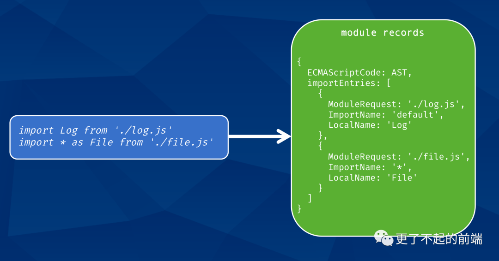

## 背景

众所周知，早期 JavaScript 原生并不支持模块化，直到 2015 年，TC39 发布 ES6，其中有一个规范就是 ES modules（为了方便表述，后面统一简称 ESM）。但是在 ES6 规范提出前，就已经存在了一些模块化方案，比如 CommonJS（in Node.js）、AMD。ESM 与这些规范的共同点就是都支持导入（import）和导出（export）语法，只是其行为的关键词也一些差异

## CommonJS

```js{1}
//add.js
const add = (a,b)=>a+b;
module.exports = add;
//index.js
const add = reqire('./add')

add(1,2)

```

## AMD

```js{1}
//add.js
define(function(){
    const add = (a,b)=> a + b;
    return add ;
})

//index.js
reqire(['./add'],function(add){
    add(1,5)
})

```

## ESM

```js{1}
//add.js
const add = (a,b)=>a+b
export defaul add

//index.js
import add from './add'
add(1,6)

```

ESM 的出现不同于其他的规范，因为这是 JavaScript 官方推出的模块化方案，相比于 CommonJS 和 AMD 方案，ESM 采用了完全静态化的方式进行模块的加载.

## ESM 规范

### 模块导出

模块导出只有一个关键字：export,最简单的方法在变量前面添加 export 关键字。

```js{1}
export const name ='你的名字'
```

可以在 let ,const ,var 前直接加上 export，也可以是 function，class 前面加上 export

```js{1}
export function getName(){
    return name
}

export class Logger {
    log(...args){
        console.log(...args)
    }
}

```

上面的导出方法也可以使用大括号的方式进行简写

```js{1}
const name = 'string'

funciton getName(){
    return name
}

class Logger{
    log(...args){
        console.log(...args)
    }
}

export {name,getName,Logger}

```

最后一种语法，也是我们经常使用的，导出默认模块。

```js{1}
const name = 'string'
export default name

```

### 模块导入

模块的导入使用import，并配合 from 关键词。

```js{1}
//main.js
import name from './module.js'

//module.js
const name = 'string'
export default name

```

这样直接导入的方式，module.js 中必须使用 export default，也就是说 import 语法，默认导入的是default模块。如果想要导入其他模块，就必须使用对象展开的语法。

```js{1}
//main.js
import age, { name ,getName } from './module.js'

//module.js

export const name = 'Shenfq'
export const getName = () => name

```

如果模块文件同时导出了默认模块，和其他模块，在导入时，也可以同时将两者导入。

```js{1}
// main.js
import name, { getName } from './module.js'

//module.js
const name = 'Shenfq'
export const getName = () => name
export default name

```

当然，ESM 也提供了重命名的语法，将导入的模块进行重新命名。

```js{1}
//main.js
import * as mod from  './module.js'
let name = ''
name = mod.name
name = mod.getName()

// module.js

export const name = 'Shenfq'
export const getName = () => name
```

上述写法就相当于于将模块导出的对象进行重新赋值：

```js{1}
// main.js

import { name, getName } from './module.js'
const mod = { name, getName }
```

同时也可以对单独的变量进行重命名：

```js{1}
/ main.js
import { name, getName as getModName }
```

### 导入同时进行导出

如果有两个模块 a 和 b ，同时引入了模块 c，但是这两个模块还需要导入模块 d，如果模块 a、b 在导入 c 之后，再导入 d 也是可以的，但是有些繁琐，我们可以直接在模块 c 里面导入模块 d，再把模块 d 暴露出去。

```js{1}
// module_c.js
import { name, getName } from './module_d.js'
export { name, getName }
```

这么写看起来还是有些麻烦，这里 ESM 提供了一种将 import 和 export 进行结合的语法。

```js{1}
export { name, getName } from './module_d.js'
```
上面是 ESM 规范的一些基本语法，如果想了解更多，可以翻阅阮老师的 《ES6 入门》。


## ESM 与 CommonJS 的差异

首先是语法上差异，esm导入导出import,export语法, cmd 导入导出reqire(),module.exprots 语法。


另一个 ESM 与 CommonJS 显著的差异在于，ESM 导入模块的变量都是强绑定，导出模块的变量一旦发生变化，对应导入模块的变量也会跟随变化，而 CommonJS 中导入的模块都是值传递与引用传递，类似于函数传参（基本类型进行值传递，相当于拷贝变量，非基础类型【对象、数组】，进行引用传递）。

下面我们看下详细的案例：**CommonJS**

```js{1}
//a.js
const mod = require('./b)
setTime(()=>{
    console.log(mod)
},1000)

//b.js
let mod = 'first value'
setTime(()=>{
    mod = 'second value'
})

module.exports = mod
```
输出结果：
```
$ node a.js
first value
```


**ESM**
```js{1}
//a.mjs
import mod from './a.mjs';
setTime(()=>{
    console.log(mod)
},1000);

//a.mjs
export let mod  = 'first value' 

setTime(()=>{
    mod = 'second value'
},500)

```
输出结果：
```
node --experimental-modules a.mjs
# (node:99615) ExperimentalWarning: The ESM module loader is experimental.
second value
```

另外，CommonJS 的模块实现，实际是给每个模块文件做了一层函数包裹，从而使得每个模块获取 require/module、__filename/__dirname 变量。那上面的 a.js 来举例，实际执行过程中 a.js 运行代码如下：

```js{1}
// a.js
(function(exports, require, module, __filename, __dirname) {
 const mod = require('./b')
  setTimeout(() => {
    console.log(mod)
  }, 1000)
});
```

而 ESM 的模块是通过 import/export 关键词来实现，没有对应的函数包裹，所以在 ESM 模块中，需要使用 import.meta 变量来获取 __filename/__dirname。import.meta 是 ECMAScript 实现的一个包含模块元数据的特定对象，主要用于存放模块的 url，而 node 中只支持加载本地模块，所以 url 都是使用 file: 协议。

```
import url from 'url'
import path from 'path'
// import.meta: { url: file:///Users/dev/mjs/a.mjs }
const __filename = url.fileURLToPath(import.meta.url)
const __dirname = path.dirname(__filename)
```

**加载的原理**

步骤：

* Construction（构造）：下载所有的文件并且解析为module records。
* Instantiation（实例）：把所有导出的变量入内存指定位置（但是暂时还不求值）。然后，让导出和导入都指向内存指定位置。这叫做『linking(链接)』。
* Evaluation（求值）：执行代码，得到变量的值然后放到内存对应位置。

 **模块记录**

所有的模块化开发，都是从一个入口文件开始，无论是 Node.js 还是浏览器，都会根据这个入口文件进行检索，一步一步找到其他所有的依赖文件。

```js{1}
// Node.js: main.mjs
import Log from './log.mjs'

```

```js{1}
<!-- chrome、firefox -->
<script type="module" src="./log.js"></script>
```

值得注意的是，刚开始拿到入口文件，我们并不知道它依赖了哪些模块，所以必须先通过 js 引擎静态分析，得到一个模块记录，该记录包含了该文件的依赖项。所以，一开始拿到的 js 文件并不会执行，只是会将文件转换得到一个模块记录（module records）。所有的 import 模块都在模块记录的 importEntries 字段中记录，更多模块记录相关的字段可以查阅tc39.es。



**模块构造**

得到模块记录后，会下载所有依赖，并再次将依赖文件转换为模块记录，一直持续到没有依赖文件为止，这个过程被称为『构造』（construction）。模块构造包括如下三个步骤：

* 模块识别（解析依赖模块 url，找到真实的下载路径）；
* 文件下载（从指定的 url 进行下载，或从文件系统进行加载）；
* 转化为模块记录（module records）

目前为止，主流浏览器都已经支持 ESM 了，只需在 script 标签传入指定的 type="module" 即可。

```js{1}
<script type="module" src="./main.js"></script>
```

另外，我们知道在 Node.js 中，要使用 ESM 有时候需要用到 .mjs 后缀，但是浏览器并不关心文件后缀，只需要 http 响应头的MIME类型正确即可（Content-Type: text/javascript）。同时，当 type="module" 时，默认启用 defer 来加载脚本。这里补充一张 defer、async 差异图。

### 服务端

浏览器能够通过 script 标签指定当前脚本是否作为模块处理，但是在 Node.js 中没有很明确的方式来表示是否需要使用 ESM，而且 Node.js 中本身就已经有了 CommonJS 的标准模块化方案。就算开启了 ESM，又通过何种方式来判断当前入口文件导入的模块到底是使用的 ESM 还是 CommonJS 呢？为了解决上述问题，node 社区开始出现了 ESM 的相关草案，具体可以在 github 上查阅。

2017年发布的 Node.js 8.5.0 开启了 ESM 的实验性支持，在启动程序时，加上 --experimental-modules 来开启对 ESM 的支持，并将 .mjs 后缀的文件当做 ESM 来解析。早期的期望是在 Node.js 12 达到 LTS 状态正式发布，然后期望并没有实现，直到最近的 13.2.0 版本才正式支持 ESM，也就是取消了 --experimental-modules 启动参数。具体细节可以查看 Node.js 13.2.0 的官方文档。

关于 .mjs 后缀社区有两种完全不同的态度。支持的一方认为通过文件后缀区分类型是最简单也是最明确的方式，且社区早已有类似案例，例如，.jsx 用于 React 组件、.ts 用于 ts 文件；而支持的一方认为，.js 作为 js 后缀已经存在这么多年，视觉上很难接受一个 .mjs 也是 js 文件，而且现有的很多工具都是以 .js 后缀来识别 js 文件，如果引入了 .mjs 方案，就有大批量的工具需要修改来有效的适配 ESM。

所以除了 .mjs 后缀指定 ESM 外，还可以使用 pkg.json 文件的 type 属性。如果 type 属性为 module，则表示当前模块应使用 ESM 来解析模块，否则使用 CommonJS 解析模块。

```js{1}
{
  "type": "module" // module | commonjs(default)
}
```

当然有些本地文件是没有 pkg.json 的，但是你又不想使用 .mjs 后缀，这时候只需要在命令行加上一个启动参数 --input-type=module。同时 input-type 也支持 commonjs 参数来指定使用 CommonJS（-—input-type=commonjs）。总结一下，Node.js 中，以下三种情况会启用 ESM 的模块加载方式：

* 件后缀为.mjs;
* pkg.json 中 type 字段指定为 module；
* 启动参数添加 --input-type=module。

同样，也有三种情况会启用 CommonJS 的模块加载方式：

* 文件后缀为.cjs;
* pkg.json 中 type 字段指定为 commonjs；
* 启动参数添加 --input-type=commonjs。

虽然 13.2 版本去除了 --experimental-modules 的启动参数，但是按照文档的说法，在 Node.js 中使用 ESM 依旧是实验特性。