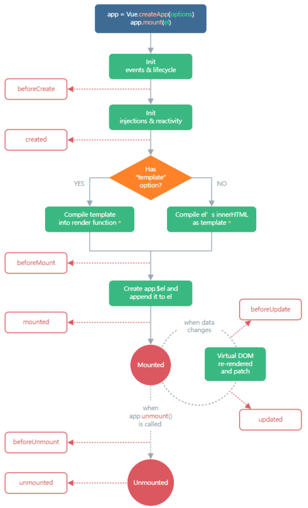

## 组合式 API
[官方文档](https://v3.cn.vuejs.org/api/composition-api.html)

###  5. reactive 对比 ref
- 从定义数据角度对比：
    - ref用来定义：<font color='red'>基本数据类型数据</font>
    - reactive用来定义：<font color='red'>对象（数组）类型数据</font>
    - 备注：ref 也可以用来定义<font color='red'>对象(数组)类型数据</font>，它内部会自动通过reactive转换为<font color='red'>代理对象</font>

- 从原理角度对比
    - ref通过Object.defineProperty()的get与set来实现响应式（数据劫持）
    - reactive通过使用<font  color='red'>Proxy</font>来实现响应式（数据劫持），并通过<font  color='red'>Reflect</font>操作源对象内部的数据

- 从使用角度对比
    - ref定义的数据：操作数据需要.value,读取数据时模板中直接读取<font  color='red'>不需要</font>.value
    - reactive定义的数据：操作数据与读取数据：<font  color='red'>均不需要</font>.value

### 6.setup的两个注意点
- setup执行的时机
    - 在beforeCreate之前执行一次，this是undefined
- setup的参数
    - props:值为对象，包含：组件外部传递过来，却组件内部声明接受了属性
    - context:执行上下文对象
        - attr:值为对象，包含：组件外部传递过来，但没有在props配置中声明的属性，相当于this.$attr
        - slots:收到的插槽内容，相当于this.$slots
        - emit:分发自定义事件的函数，相当于this.$emit

### 7.计算属性与监视

**1.computed函数**

- 与vue2.x中computed配置功能一致
- 写法

```js
import {computed} from vue;

export default {
    
    setup(){
        //只读
        const count = ref(1)
        const plusOne = computed(() => count.value + 1)

        console.log(plusOne.value) // 2

        //读，改
        const count = ref(1)
        const plusOne = computed({
            get: () => count.value + 1,
            set: val => {
                count.value = val - 1
            }
        })

        plusOne.value = 1
        console.log(count.value) // 0

    }
}

```

**2.watch函数**
- 与vue2.x中watch配置功能一致
- 写法
```js

    import {ref,watch, reactive} from 'vue'

    export default {
        setup(){
            let count = ref(1)
            let person = reactive({
                name:'张三',
                age:18
            })
            //单个监听
            watch(count,(newValue, oldValue)=>{},immediate: true)
            //多个监听
            watch([person,count], (newValue, oldValue) => {
                console.log("The new person value is: ", newValue, oldValue);
            },
            { deep: false }
            );

        }
    }

```

- 两个小坑
    - 监视reactive定义的响应式数据时，oldValue无法正确获取，强制开启了深度监视（deep配置失效）
    - 监视reactive定义的响应式数据中某个属性时，deep配置有效
    ```js
        //情况一：监视ref定义的响应式数据
        watch(sum,(newValue,oldValue)=>{},{immediate: true})

        //情况二：监视多个ref定义的响应式数据
        watch([sum,msg],(newValue,oldValue)=>{})

        /*情况三：监视reactive定义的响应式数据
            若watch监视的是reactive定义的响应式数据，则无法正确获取oldValue
            若watch监视的是reactive定义的响应式数据，则强制开启了深度监视
        */
        watch(person,(newValue,oldValue)=>{},
        {immediate: true,deep:true})//此处的deep配置失效

        //情况四：监视reactive定义的响应式数据中的某个属性
        watch(()=>person.job,(newValue,oldValue)=>{}, {immediate: true,deep:true})

        //情况五：监视ref定义的响应式数据中的person
        watch(person,(newValue,oldValue)=>{}, {immediate: true,deep:true})

    ```
**3.watchEffect函数**
- watch的套路是：既要指明监视的属性，也要指明监视的回调
- watchEffect的套路是：不用指明监视哪个属性，监视的回调中用到哪个属性，那就监视哪个属性
- watchEffect有点像computed:
    - 但computed注重的计算出来的值（回调函数的返回值），所以必须要写返回值
    - 而watchEffect更注重的是过程（回调函数的函数体），所以不用写返回值
    ```js
        watchEffect(()=>{
            const x1 = sum.vulue;
            const x2 = person.age;
        })
    ```
### 8生命周期

|  类型   | 字节  | 
|  ----  | ----  | 
|    |  | 

- vue3中可以继续使用vue2生命周期钩子变化,但是有两个更名
    - beforeDestoy改名beforeUmmount
    - destoyed改名dmmounted

- vue3也提供Composition API 形式的生命周期钩子，与vue2中钩子对应关系
    - beforeCreate ===> setup()
    - created  =======> setup()
    - beforeMount ====> onBeforeMount
    - mounted ========> onMounted
    - beforeUpdate ===> onBeforeUpdate
    - updated ========> onUpdate
    - beforeUnmount ==> onBeforeUnmount
    - unmounted ======> onUnmounted

### 9.自定义hook函数
- 什么是hook? --- 本质是一个函数，把setup函数中使用的composition Api进行了封装
- 类似vue2.x的mixin
- 自定义hook的优势，复用代码，让setup中的逻辑更加清楚易懂

### toRef
- 作用：创建一个ref对象，其value值指向另一个对象中的某一个属性值
- 语法：const name = toRef(person,'name')
- 应用：要将响应式对象中的某个属性单独提供给外部使用时
- 拓展：toRefs与toRef功能一样，但可以批量创建多个ref对象，语法toRefs(person)

### 其他composition API

**1.shallowReactive 与 shallowRef**
- shallowReactive: 只处理对象最外层属性的响应式（浅响应式）
- shallRef:只处理基本数据类型的响应式，不进行对象的数据响应处理
- 什么时候使用？
    - 如果有一个对象数据，结构比较深，但变化时只是外层属性变化===》shallowReactive
    - 如果有一个对象数据，后续功能不会修改该对象中的属性，而是新生的对象来替换===》shallowRef

**2.readonly 与 shallowReadonly**
- readonly:让一个响应式对象变成只读的（深只读）
- shallowReadonly:让一个响应式数据变成只读的（浅只读）
- 应用场景：不希望数据修改时

**3.toRaw与markRaw**
- toRaw:
    - 作用：将一个由reactive生成响应对象转换为普通对象
    - 使用场景：用于读取响应式对象的普通对象，对这个普通对象的所有操作，不会引起页面变化
- markRaw:
    - 作用：标记一个对象，是其永远不会再变成响应式对象
    - 应用场景：
        - 有一些不应该被设置为响应式的，例如复杂的第三方类库等
        - 当渲染具有不可变数据源的大列表时，跳过响应式转换可以提高性能

**4.customRef**
- 作用：创建一个自定义的ref,并对其依赖项跟踪和更新触发进行显示控制,它需要一个工厂函数，该函数接收 track 和 trigger 函数作为参数，并且应该返回一个带有 get 和 set 的对象
- 实现案例：
    ```html 
        <input v-model="text" />
    ```
    ```js

        function useDebouncedRef(value, delay = 200) {
            let timeout
            return customRef((track, trigger) => {
                return {
                    get() {
                        track()
                        return value
                    },
                    set(newValue) {
                        clearTimeout(timeout)
                        timeout = setTimeout(() => {
                        value = newValue
                        trigger()
                        }, delay)
                    }
                }
            })
        }

        export default {
            setup() {
                return {
                text: useDebouncedRef('hello')
                }
            }
        }
    ```

**5.provide 与 inject**

组件层级比较深，用props数据通讯,比较麻烦


- 作用：实现祖孙组件间通信

- 具体用法：

    祖组件：
    ```js
        import {provide,reactive} from 'vue'

        setup(){
            let person = reactive({
                name:'只能干是'
            })
            provide('person',person);
            
            return {person}
        }

    ```

    孙组件：
    ```js
        import { inject } from 'vue'

        setup(){
            let person = inject('person')
            
            return {person}
        }
    ```
